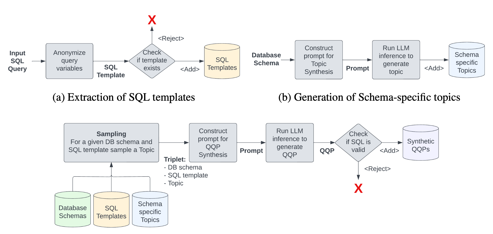
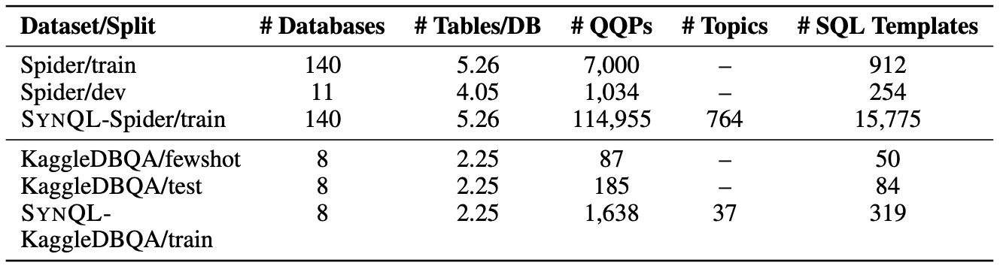
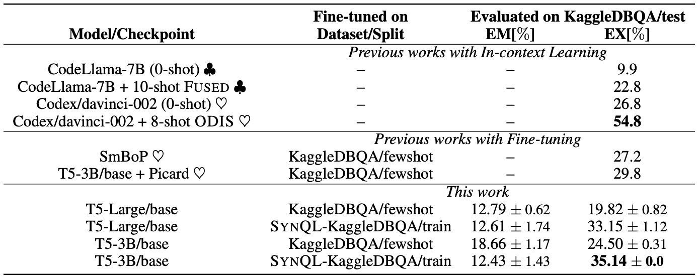
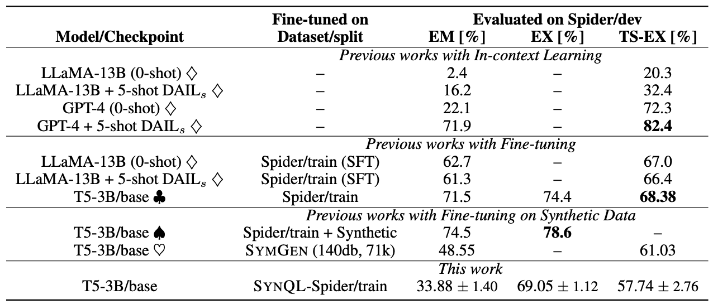

# SynQL
[Data](##data) | [Models](##models) | [Paper](https://openreview.net/forum?id=WrexlGBDCH#discussion) | [Citation](##citation) | [Getting Started](runner)

`SynQL` is a method for synthetically generating Text-to-SQL Question-Query Pairs (QQPs). This project is based on the [SynQL paper](https://openreview.net/forum?id=WrexlGBDCH#discussion), which we recommend reading for a detailed explanation of the methodology. A high level overview of the methodology is shown below. 



Given that manual data generation is both expensive and labor-intensive, alternative methods involving Synthetic Data Generation (SDG) and data augmentation techniques for the text-to-SQL domain ([Yu et al., 2021](https://arxiv.org/abs/2009.13845), [Wu et al., 2022](https://aclanthology.org/2021.emnlp-main.707/), [Hu et al., 2023](https://aclanthology.org/2023.findings-acl.86)) have become increasingly essential. In this paper, we focus on this problem and propose a new method for generating synthetic text-to-SQL data. Contributions of this paper are as follows:
- We present a systematic comparison of text-to-SQL SDG methods and highlight the need
for more diverse data.
- To address this, we propose SynQL, a novel synthetic data generation method for Text-to-SQL that leverages in-context learning and introduces ’Topics’—a new type of contextual information enhancing the diversity of generated QQPs.
- In order to assess the quality of our method, we experiment with KaggleDBQA ([Lee et al. 2021](https://github.com/Chia-Hsuan-Lee/KaggleDBQA)), an established low-resource benchmark, and demonstrate that models trained on SynQL-KaggleDBQA exceed the performance of those trained on the original data.
- Additionally, to better understand the properties of SynQL data, we generate a synthetic equivalent of the Spider dataset ([Yu et al. 2018](https://yale-lily.github.io/spider)) and analyze model performance when trained on both original and synthetic data.
- Finally, we open-source both [method](runner) and [synthetic datasets](##data) for further research.

## Data 
We have used the SynQL method to generate the datasets listed below. These datasets are available for download on the Hugging Face dataset hub. A detailed explanation of the data generation process can be found in the [SynQL paper](https://openreview.net/forum?id=WrexlGBDCH#discussion). The `Spider` dataset can be found [here](https://yale-lily.github.io/spider). The `KaggleDBQA` dataset can be found [here](https://github.com/Chia-Hsuan-Lee/KaggleDBQA).

| Dataset | Description | Link |
| --- | --- | --- |
| SynQL-Spider-Train | Synthetically generated data based on the Spider training split | [Download](https://huggingface.co/datasets/semiotic/SynQL-Spider-Train) | 
| SynQL-KaggleDBQA-Train | Synthetically generated data based on the KaggleDBQA training split | [Download](https://huggingface.co/datasets/semiotic/SynQL-KaggleDBQA-Train) |



## Models
We have previously used data generated using the SynQL method to train the models listed below. These models are available for download on the Hugging Face model hub. The `T5` training framework available in the [picard](https://github.com/ServiceNow/picard) repository was used to train these models. A detailed explanation of the training configuration and process can be found in the [SynQL paper](https://openreview.net/forum?id=WrexlGBDCH#discussion).

| Model | Dataset | Description | Link |
| --- | --- | --- | --- |
| T5-3B | SynQL-Spider-Train | T5-3B model finetuned on SynQL-Spider-Train | [Download](https://huggingface.co/semiotic/T5-3B-SynQL-Spider-Train-Run-00) |
| T5-3B | SynQL-KaggleDBQA-Train | T5-3B model finetuned on SynQL-Spider-Train | [Download](https://huggingface.co/semiotic/T5-3B-SynQL-KaggleDBQA-Train-Run-00) |




## Getting Started
Checkout the [runner](runner) directory for examples on how to synthesize QQPs using SynQL. Please open an issue if you have any questions or need help getting started.

## Citation
If you use SynQL, or any of the datasets or models provided here, you can use the following citation:

```bibtex
@inproceedings{baumgartner-2024-synql,
    title = "SynQL: Synthetic Data Generation for In-Domain, Low-Resource Text-to-SQL Parsing",
    author = "Baumgartner, Denver  and
      Kornuta, Tomasz",
    booktitle = "Third Table Representation Learning Workshop (TRL) at the Neural Information Processing Systems Conference (NeurIPS)",
    year = "2024",
    month = "December",
    url = "https://openreview.net/pdf?id=WrexlGBDCH",
}
```     
For any questions or feedback, please open an issue or contact Denver Baumgartner at (denver[at]semiotic[dot]ai).